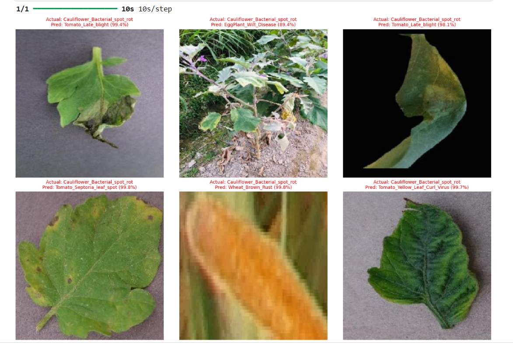
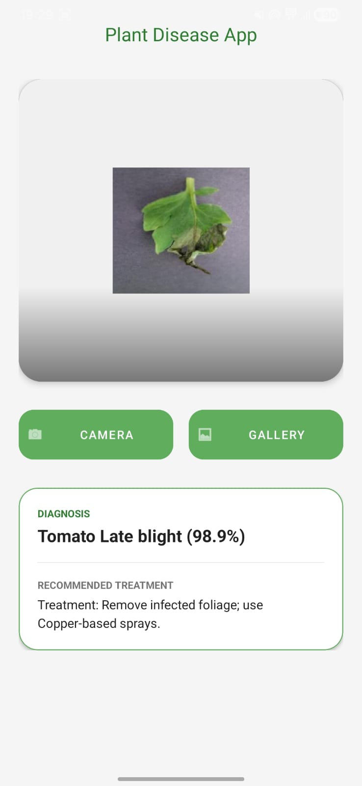

# 🌱 AgroVision AI

[](https://www.python.org/)
[](https://tensorflow.org/)
[](https://www.tensorflow.org/lite)
[](#)
[](#)

An end-to-end AI-powered mobile solution for detecting **35 plant diseases** across **7 plant species** using Deep Learning and TensorFlow Lite.

This project combines:
- 🌿 Deep Learning Model Training
- 📱 Android Mobile Application
- ⚡ Offline Disease Detection
- 🤖 TensorFlow Lite Deployment

The system is designed to help farmers and agricultural workers identify plant diseases instantly using a smartphone camera — even without an internet connection.

---

# 🚀 Project Overview

Plant diseases cause major agricultural losses worldwide. Early diagnosis is critical, but many farmers lack access to fast and reliable disease detection systems.

**AgroVision AI** solves this problem by providing:
- Real-time plant disease prediction
- Offline mobile inference
- Lightweight optimized AI model
- High prediction accuracy
- Mobile-ready deployment using TensorFlow Lite

---

# 🧠 Deep Learning Model Details

| Component | Details |
|---|---|
| Architecture | EfficientNetV2-S |
| Framework | TensorFlow 2.15 |
| Training Technique | Transfer Learning |
| Loss Function | Focal Loss |
| Deployment Format | TensorFlow Lite |
| Optimization | Float16 Quantization |
| Model Size | ~30 MB |
| Dataset | PlantVillage Dataset |

---

# 📊 Model Performance

| Metric | Score |
|---|---|
| Validation Accuracy | 99.3% |
| Mobile Inference Speed | <100ms |
| Disease Classes | 35 |
| Plant Species | 7 |

---

# 📸 Performance Showcase

## Real-World Predictions



*Figure: Sample predictions showing extremely high confidence scores on unseen test images.*

---

# 🛠️ Android Tech Stack

| Technology | Purpose |
|---|---|
| Java | Android Development |
| TensorFlow Lite | On-device AI inference |
| Android Studio | Development Environment |
| CameraX / Intent APIs | Image Capture |
| XML | UI Design |

---

# 📱 Android App Output

## Real-Time Disease Prediction



*Figure: Android application showing real-time plant disease prediction with confidence score.*

---

# 📂 Repository Structure

```bash
AgroVision-AI/
│
├── Android_App/
│   ├── app/
│   ├── gradle/
│   ├── build.gradle
│   ├── settings.gradle
│   └── gradlew
│
├── Plant_Disease_Detection.ipynb
├── plant_care_offline.tflite
├── labels.txt
├── Screenshot_2026-03-13_185227.jpg
└── README.md
```
---

# 👩‍💻 Author

### Aayushi Nayak
B.Tech CSE Student


---
